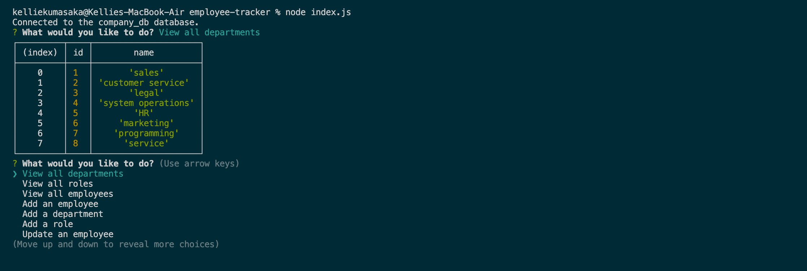
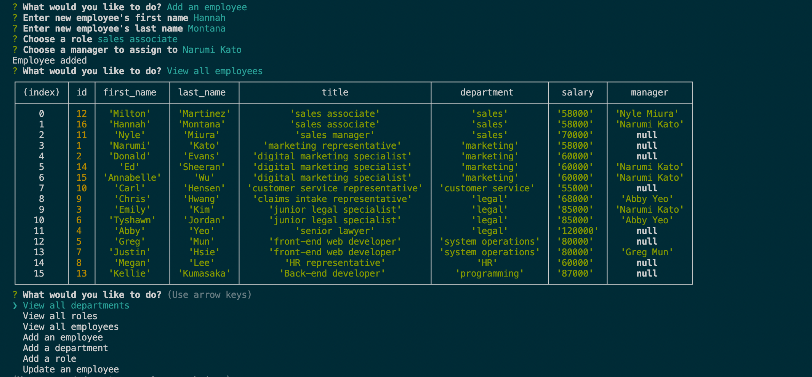
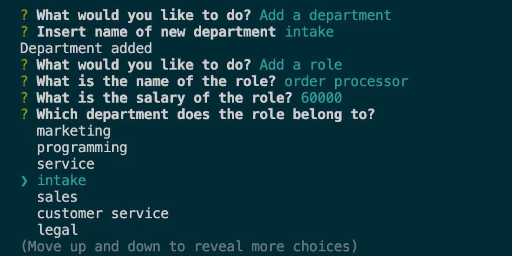

# Employee Tracker 
## Description
This in-terminal app allows the user to create and view employees, departments, and roles within a company database. Upon running `node index.js` in terminal, the user is presented with options to view all departments, view all employees, view all roles, add a department, add a role, add an employee, update an employee or quit. Once an option is chosen, the user is then lead through a series of prompts that all the user to do any of the aforestated options. This app allows the user to keep track of their employees and internal management, as well as update them with ease.

Check out the video of the application [here](https://youtu.be/E_TKm1zDF7k).

When you first run the program, you are presented with options and if you click on "View all departments" you are given a table with all the departments then brought back to the main menu options.

If you choose to add an employee, role, or department, you will be presented with a number of prompts that will lead you through creating one of the aforementioned choices. If you view the respective data, you will be presented with an updated table with your inputted data.

Additionally, your new data can be built upon if you choose to do so. For example, if you add a new department, you are able to also add a new role to the newly created department.

## Table of Contents
* [Installation](#installation)
* [Usage](#usage)
* [Contributing](#contributing)
* [Tests](#tests)
* [License](#license)
* [Questions](#questions)

## Installation
Run `npm i` to install `inquirer.js`, `mysql2`, and `console.table`.

## Usage

## Contributing

## Tests

## License
This project is licensed under MIT.

## Questions
Here is a link to my [GitHub](https://github.com/kelliekumasaka) or shoot me an [email](mailto:kelliek3@gmail.com).
